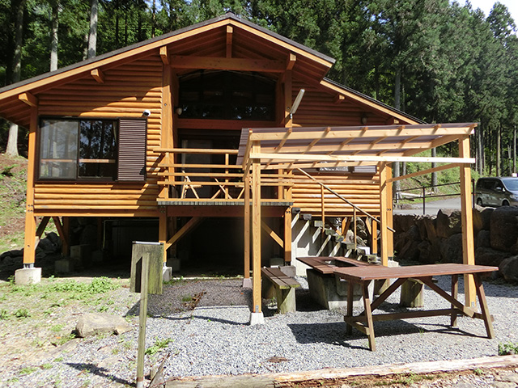
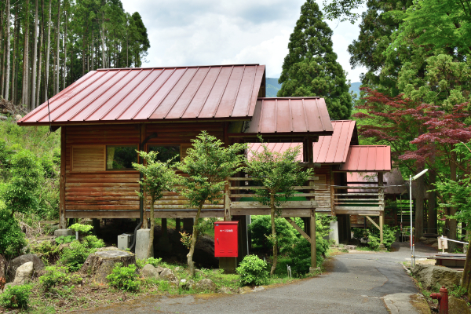
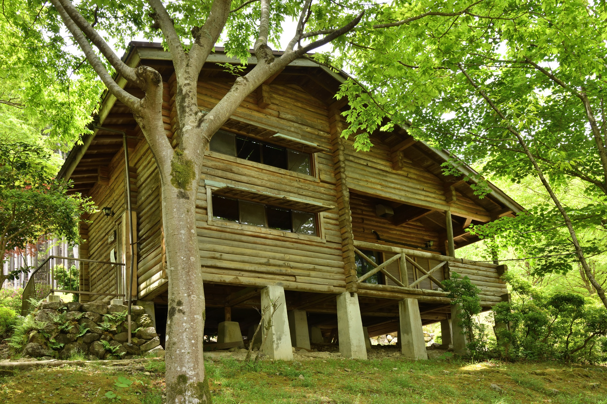
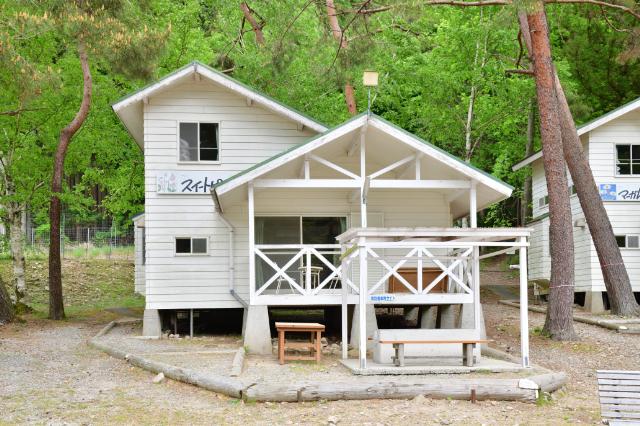
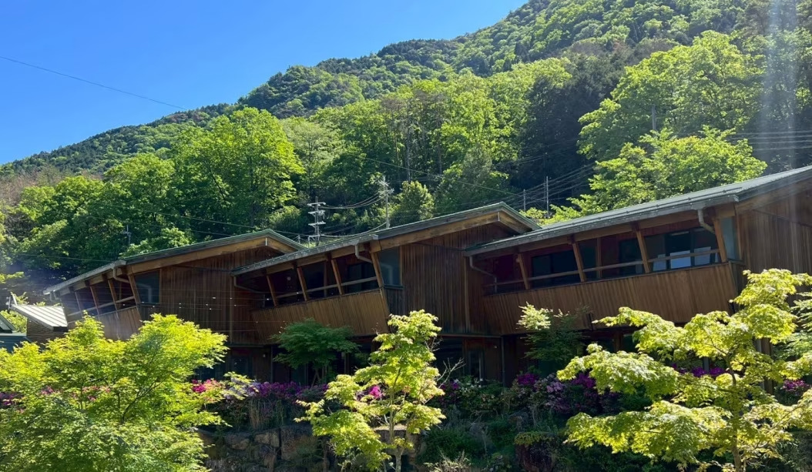
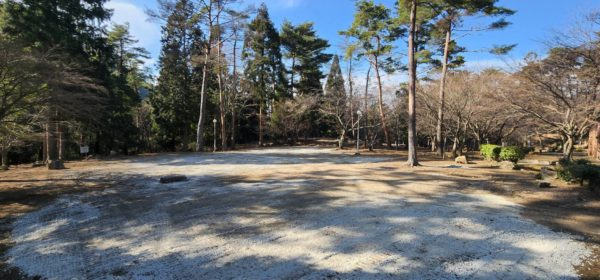
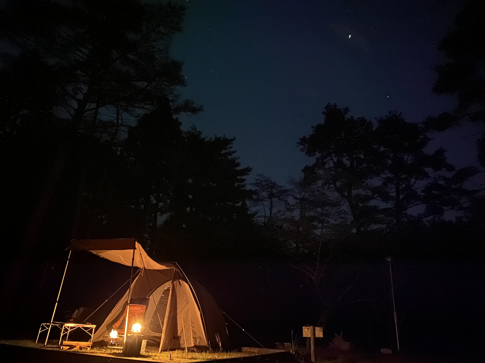
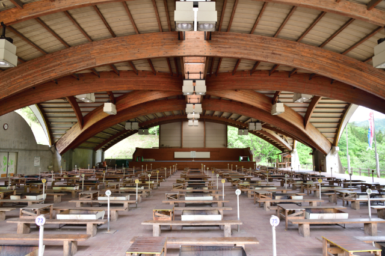
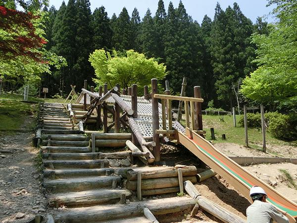
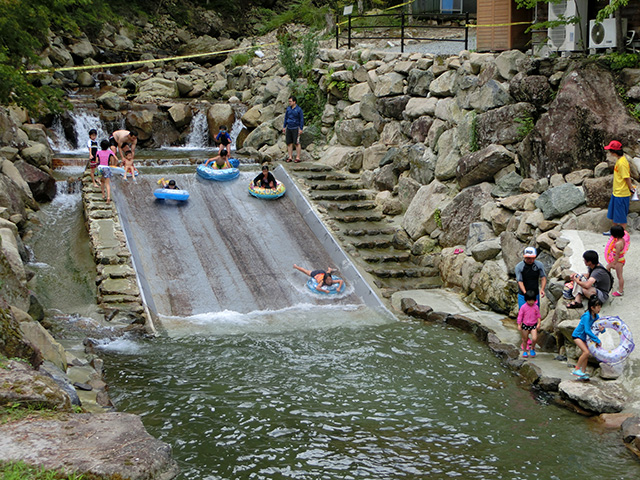

```html
<!DOCTYPE html>
<html lang="ja">
<head>
<meta charset="UTF-8">
<meta name="viewport" content="width=device-width, initial-scale=1.0">

<title>神之河のひととき</title>

<link href="https://fonts.googleapis.com/css2?family=Noto+Serif+JP:wght@400;700&display=swap" rel="stylesheet">

<style>

*{
    margin:0;
    padding:0;
    box-sizing:border-box;
}

html{
    scroll-behavior:smooth;
}

body{
    font-family:'Noto Serif JP', serif;
    background:#161513;
    color:#fff;
    overflow-x:hidden;
    line-height:1.8;
}

/* ===== ヒーロー ===== */

.hero{
    position:relative;
    height:100svh;
    overflow:hidden;
}

.hero video{
    width:100%;
    height:100%;
    object-fit:cover;
    filter:brightness(0.5);
    transform:scale(1.05);
}

.hero::after{
    content:"";
    position:absolute;
    inset:0;
    background:
    linear-gradient(
        to bottom,
        rgba(0,0,0,0.15),
        rgba(0,0,0,0.82)
    );
}

/* 火の粉 */

.spark{
    position:absolute;
    bottom:-20px;
    width:4px;
    height:4px;
    background:rgba(255,180,100,0.8);
    border-radius:50%;
    animation:floatUp linear infinite;
}

.spark:nth-child(1){
    left:10%;
    animation-duration:8s;
}

.spark:nth-child(2){
    left:30%;
    animation-duration:10s;
    animation-delay:1s;
}

.spark:nth-child(3){
    left:50%;
    animation-duration:7s;
}

.spark:nth-child(4){
    left:70%;
    animation-duration:11s;
}

.spark:nth-child(5){
    left:85%;
    animation-duration:9s;
}

@keyframes floatUp{
    from{
        transform:translateY(0) scale(1);
        opacity:0;
    }

    10%{
        opacity:1;
    }

    to{
        transform:translateY(-120vh) scale(0);
        opacity:0;
    }
}

/* 中央 */

.hero-content{
    position:absolute;
    bottom:13%;
    left:50%;
    transform:translateX(-50%);
    width:88%;
    z-index:20;
}

.hero-content h1{
    font-size:42px;
    line-height:1.4;
    letter-spacing:4px;
    margin-bottom:18px;
    animation:fadeUp 1.2s ease;
}

.hero-content p{
    font-size:14px;
    color:#ddd;
    line-height:2;
    animation:fadeUp 1.8s ease;
}

/* ボタン */

.hero-btn{
    display:inline-block;
    margin-top:28px;
    padding:14px 28px;
    border-radius:999px;
    text-decoration:none;
    color:#fff;
    letter-spacing:2px;
    font-size:12px;

    backdrop-filter:blur(12px);
    background:rgba(255,255,255,0.1);
    border:1px solid rgba(255,255,255,0.2);

    transition:0.4s;
}

.hero-btn:hover{
    background:rgba(255,255,255,0.2);
}

/* スクロール */

.scroll{
    position:absolute;
    bottom:25px;
    left:50%;
    transform:translateX(-50%);
    z-index:30;

    font-size:10px;
    letter-spacing:5px;
    opacity:0.7;

    animation:float 2s infinite;
}

@keyframes float{
    0%{
        transform:translate(-50%,0);
    }

    50%{
        transform:translate(-50%,10px);
    }

    100%{
        transform:translate(-50%,0);
    }
}

/* ===== セクション ===== */

.section{
    padding:90px 6%;
    background:#f3eee7;
    color:#222;
}

.section.dark{
    background:#1a1a1a;
    color:#fff;
}

/* タイトル */

.section-title{
    margin-bottom:45px;
}

.section-title h2{
    font-size:30px;
    letter-spacing:3px;
    margin-bottom:10px;
}

.section-title p{
    font-size:12px;
    color:#777;
}

/* カード */

.grid{
    display:flex;
    flex-direction:column;
    gap:28px;
}

.card{
    overflow:hidden;
    border-radius:28px;
    background:#fff;

    box-shadow:
    0 12px 40px rgba(0,0,0,0.08);

    transition:0.5s;

    opacity:0;
    transform:translateY(40px);
}

.card.show{
    opacity:1;
    transform:translateY(0);
}

.card img{
    width:100%;
    height:320px;
    object-fit:cover;
}

.card-content{
    padding:24px;
}

.card-content h3{
    font-size:22px;
    margin-bottom:12px;
    color:#111;
}

.card-content p{
    font-size:13px;
    line-height:2;
    color:#666;
}

/* ===== バナー ===== */

.wide-banner{
    position:relative;
    height:80vh;
    overflow:hidden;
}

.wide-banner img{
    width:100%;
    height:100%;
    object-fit:cover;
    filter:brightness(0.72);
}

.banner-text{
    position:absolute;
    bottom:12%;
    left:8%;
    right:8%;
}

.banner-text h2{
    font-size:34px;
    margin-bottom:15px;
}

.banner-text p{
    font-size:13px;
    line-height:2;
    color:#eee;
}

.btn{
    display:inline-block;
    margin-top:25px;
    padding:14px 30px;

    border-radius:999px;
    background:#fff;
    color:#111;

    text-decoration:none;
    font-size:12px;
    letter-spacing:2px;
}

/* ===== フッター ===== */

footer{
    background:#111;
    padding:35px 20px;
    text-align:center;
    color:#777;
    font-size:11px;
}

/* ===== アニメ ===== */

@keyframes fadeUp{

    from{
        opacity:0;
        transform:translateY(40px);
    }

    to{
        opacity:1;
        transform:translateY(0);
    }

}

/* ===== PC ===== */

@media(min-width:900px){

.hero-content{
    width:70%;
}

.hero-content h1{
    font-size:72px;
}

.hero-content p{
    font-size:18px;
}

.grid{
    display:grid;
    grid-template-columns:repeat(3,1fr);
}

.card img{
    height:280px;
}

.section{
    padding:120px 8%;
}

.banner-text h2{
    font-size:54px;
}

}

/* ===== 下固定メニュー ===== */

.bottom-nav{
    position:fixed;
    bottom:15px;
    left:50%;
    transform:translateX(-50%);

    width:90%;
    max-width:500px;

    background:rgba(255,255,255,0.1);
    backdrop-filter:blur(14px);

    border:1px solid rgba(255,255,255,0.15);

    border-radius:999px;

    display:flex;
    justify-content:space-around;
    align-items:center;

    padding:12px 10px;

    z-index:100;
}

.bottom-nav a{
    color:#fff;
    text-decoration:none;
    font-size:11px;
    letter-spacing:2px;
}

</style>
</head>

<body>

<!-- ヒーロー -->

<section class="hero">

<video autoplay muted loop playsinline>
    <source src="movie.mp4" type="video/mp4">
</video>

<!-- 火の粉 -->

<div class="spark"></div>
<div class="spark"></div>
<div class="spark"></div>
<div class="spark"></div>
<div class="spark"></div>

<div class="hero-content">

    <h1>
        神之河のひととき
    </h1>

    <p>
        森に包まれる、贅沢な時間。<br>
        川のせせらぎと焚き火の灯りに癒されるキャンプリゾート。
    </p>

    <a href="#" class="hero-btn">
        RESERVE NOW
    </a>

</div>

<div class="scroll">
    SCROLL
</div>

</section>

<!-- 宿泊 -->

<section class="section">

<div class="section-title">
    <h2>STAY</h2>
    <p>自然と調和する宿泊空間</p>
</div>

<div class="grid">

<div class="card">
    
    <div class="card-content">
        <h3>ウッドコテージ</h3>
        <p>
            木のぬくもりを感じる人気の宿泊棟。
            初心者でも快適に過ごせます。
        </p>
    </div>
</div>

<div class="card">
    
    <div class="card-content">
        <h3>せせらぎロッジ</h3>
        <p>
            静かな森の空気に包まれる、
            癒しのプライベート空間。
        </p>
    </div>
</div>

<div class="card">
    
    <div class="card-content">
        <h3>せせらぎロッジプラス</h3>
        <p>
            開放感ある広々テラスで、
            星空と焚き火を満喫。
        </p>
    </div>
</div>

<div class="card">
    
    <div class="card-content">
        <h3>天空ロッジ</h3>
        <p>
            山々を見渡せる、
            特別なロケーション。
        </p>
    </div>
</div>

<div class="card">
    
    <div class="card-content">
        <h3>マウンテンハイドアウト</h3>
        <p>
            秘密基地のような、
            自然一体型ステイ。
        </p>
    </div>
</div>

<div class="card">
    
    <div class="card-content">
        <h3>オートキャンプサイト</h3>
        <p>
            自由に楽しむアウトドア。
            星空と焚き火の時間を。
        </p>
    </div>
</div>

</div>

</section>

<!-- バナー -->

<section class="wide-banner">



<div class="banner-text">

    <h2>焚き火と星空</h2>

    <p>
        都会では味わえない、静かな夜を。<br>
        火の揺らぎと満天の星に包まれるひととき。
    </p>

    <a href="#" class="btn">
        RESERVE
    </a>

</div>

</section>

<!-- 共有施設 -->

<section class="section dark">

<div class="section-title">
    <h2>FACILITY</h2>
    <p>みんなで楽しむ憩いの空間</p>
</div>

<div class="grid">

<div class="card">
    
    <div class="card-content">
        <h3>BBQ</h3>
        <p>
            地元食材を使った本格BBQ。
            手ぶらでも気軽に楽しめます。
        </p>
    </div>
</div>

<div class="card">
    
    <div class="card-content">
        <h3>キッズエリア</h3>
        <p>
            子どもも楽しめる、
            自然の遊び空間。
        </p>
    </div>
</div>

<div class="card">
    
    <div class="card-content">
        <h3>CAFE</h3>
        <p>
            テラス席でゆったり過ごす、
            森のカフェタイム。
        </p>
    </div>
</div>

</div>

</section>

<!-- 下固定メニュー -->

<div class="bottom-nav">

<a href="#">TOP</a>
<a href="#">STAY</a>
<a href="#">MAP</a>
<a href="#">RESERVE</a>

</div>

<!-- フッター -->

<footer>
    © 神之河のひととき
</footer>

<!-- スクロールアニメ -->

<script>

const cards = document.querySelectorAll('.card');

window.addEventListener('scroll', () => {

    cards.forEach(card => {

        const cardTop = card.getBoundingClientRect().top;

        if(cardTop < window.innerHeight - 80){
            card.classList.add('show');
        }

    });

});

</script>

</body>
</html>
```
